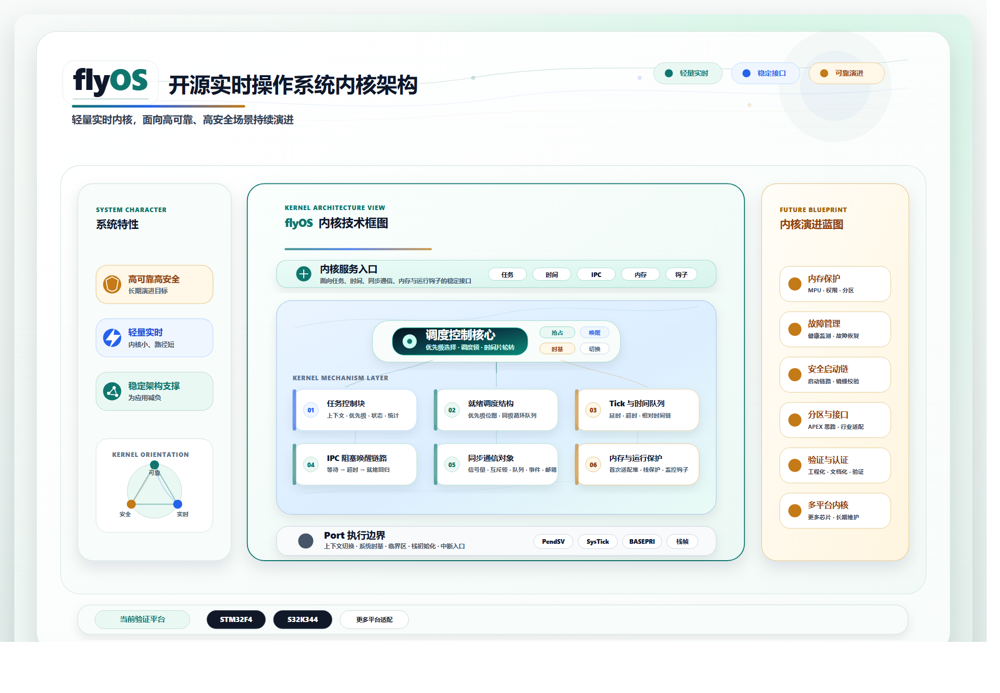

# flyOS

[简体中文](README.zh-CN.md)

flyOS is a lightweight RTOS kernel focused on task scheduling, IPC, memory management, and Cortex-M port abstraction, while evolving toward high-reliability and high-safety embedded scenarios.



## Current Status

flyOS is in an early open-source trial stage.

It is intended for embedded developers who want to:

- study a compact RTOS kernel implementation;
- evaluate task scheduling, IPC, and memory-management design choices;
- try basic porting and board bring-up on Cortex-M platforms;
- give structured feedback before the project hardens its long-term public API.

The current public version does not claim compliance with any functional-safety, information-security, or aerospace certification standard. High reliability and high safety remain long-term engineering goals, not current release promises.

## Core Capabilities

- Preemptive priority-based scheduling for Cortex-M targets.
- Time-slice scheduling and tick-driven delay handling.
- Core IPC primitives including semaphore, mutex, queue, event, and mailbox.
- Heap-based memory management with optional statistics and integrity checks.
- Portable platform boundary for STM32F4 and S32K344.

## Supported Platforms

| Platform | MCU family | Status |
| --- | --- | --- |
| `stm32f4` | Cortex-M4 | Public trial target |
| `s32k344` | Cortex-M7 | Public trial target |

## Quick Start

### 1. Add flyOS to your project

```cmake
set(FLYOS_PLATFORM "stm32f4" CACHE STRING "Target platform")
add_subdirectory(path/to/flyos-standard)

target_link_libraries(your_app PRIVATE flyos_kernel)
```

### 2. Select a platform when configuring

```bash
cmake -S . -B build -DFLYOS_PLATFORM=stm32f4
```

Available values:

- `stm32f4`
- `s32k344`

### 3. Read the onboarding docs

Start here:

- `flyos/doc/quick-start.md`
- `flyos/doc/configuration.md`
- `flyos/doc/porting-guide.md`
- `flyos/doc/api-reference.md`

## Demo Repositories

If you want a board-level STM32 demo project built around flyOS, start here:

- GitHub: `https://github.com/yiyiqiqi/flyos-stm32-demo.git`
- Gitee: `https://gitee.com/yangyang__zhang_admin/flyos-stm32-demo.git`

## Repository Layout

```text
.
├─ CMakeLists.txt
├─ README.md
├─ docs/
│  ├─ README.md
│  ├─ coding-standard.md
│  └─ flyOS-kernel-architecture.png
└─ flyos/
   ├─ CMakeLists.txt
   ├─ flyos_kernel.c
   ├─ flyos_kernel.h
   ├─ flyos_ipc.c
   ├─ flyos_ipc.h
   ├─ flyos_mem.c
   ├─ flyos_mem.h
   ├─ flyos_config.h
   ├─ flyos_type.h
   ├─ port/
   └─ doc/
```

## Documentation

- `docs/README.md` - public documentation map
- `docs/coding-standard.md` - coding conventions used in the repository
- `flyos/doc/quick-start.md` - first integration path
- `flyos/doc/api-reference.md` - public kernel API overview
- `flyos/doc/architecture.md` - runtime architecture and subsystem responsibilities
- `flyos/doc/configuration.md` - build-time configuration guide
- `flyos/doc/porting-guide.md` - platform porting guidance

## Documentation Layout Note

This release keeps two documentation levels and bilingual document pairs:

- `docs/` for repository-level public guidance;
- `flyos/doc/` for kernel-specific technical notes.

English filenames are primary. Simplified Chinese translations are provided as sibling files with the `.zh-CN.md` suffix.

## Current Boundary

This first public release focuses on the kernel trial experience.

Included in the public story:

- kernel runtime;
- IPC primitives;
- memory management;
- Cortex-M platform abstraction;
- STM32F4 and S32K344 trial ports.

Not part of the current public promise:

- certification-grade safety claims;
- mature long-term ABI/API stability guarantees;
- full commercial feature line;
- non-public planning notes and collaboration artifacts.

## Roadmap

See `ROADMAP.md` for the current public roadmap.

## Contributing

See `CONTRIBUTING.md` before opening issues or pull requests.

## Support

The maintainer welcomes trial feedback and can provide free chip-extension support for suitable public trial scenarios.

Contact: `yangyang_zhang@yeah.net`

## Dual-Platform Repositories

- GitHub: `https://github.com/yiyiqiqi/flyos-standard.git`
- Gitee: `https://gitee.com/yangyang__zhang_admin/flyos-standard.git`

The two public repositories are intended to stay aligned. Feedback can be filed on either platform.

## License

This project is released under the Apache License 2.0. See `LICENSE` for details.
